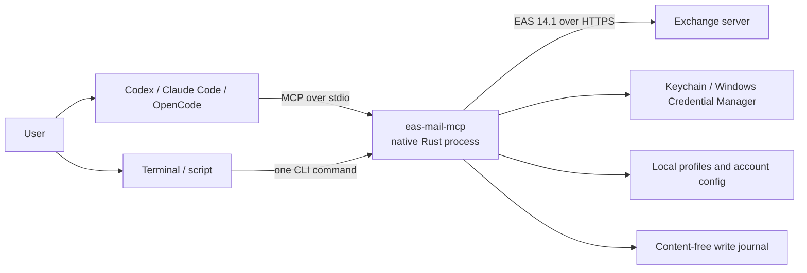

# EAS Mail MCP


`eas-mail-mcp` is a local, native MCP server and command-line client for mail and
calendars on Exchange ActiveSync 14.1 servers. AI agents use typed MCP tools;
people and scripts can use the same runtime through one-shot CLI commands. It is
designed for managed or on-premises Exchange environments where EAS is available
and a hosted connector, Microsoft Graph, or a local mailbox database is
undesirable.

Platforms: **macOS 14+** (Apple Silicon and Intel) and **Windows 11 x64**.
See [platform coverage and validation limits](docs/compatibility.md).

The public npm packages contain no operator server, domain, realm, certificate,
account, or password. Endpoint profiles are created or imported locally, and
credentials stay in the operating system credential store.

```bash
npm install -g eas-mail-mcp
eas-mail-mcp setup
```

[Setup guide](docs/getting-started.md) | [CLI reference](docs/cli.md) | [Инструкция на русском](docs/installation.ru.md) | [Support](SUPPORT.md) | [Security](SECURITY.md)

## What it does

The server exposes bounded, typed tools instead of handing an agent a raw
mailbox export.

| Area | Capabilities |
| --- | --- |
| Mail | Structured search with explicit coverage, bounded conversation reads, individual or batch message fetches, downloaded attachments |
| Mail actions | Send/reply/forward with attachments; change read state, folders, follow-up flags, and categories; delete to trash; process bounded batches |
| Automatic replies | Read or set internal/external replies and schedules, then verify the effective settings |
| People | Search one account's server directory by name or email; return only names and email addresses |
| Personal agenda | Return a compact, body-free schedule for a date range, including expanded recurrences and exceptions |
| Availability | Rank one-off and weekly recurring slots using required/optional participants, individual working hours/time zones, and buffers; server precision remains 30 minutes |
| Calendar details | Search events and fetch one selected event with its body, attendees, recurrence, and exceptions |
| Calendar actions | Create one-off or recurring events; edit/cancel a series, an occurrence, or its remaining tail; respond to a series or occurrence |
| Multiple accounts | Probe accounts independently; retain failures while other accounts work; inspect durable operation outcomes |

Typical requests include:

- "Show important unread mail from today."
- "Find a one-hour slot that is free for these participants next week."
- "Show my agenda for tomorrow without meeting bodies."
- "Find Alex's email and schedule a weekly meeting."
- "Draft a reply, show it to me, and send it only after I approve the text."

The MCP executes write tools immediately when an agent calls them. The CLI shows
a complete escaped preview and asks before committing unless `--yes` is passed.
Writes are disabled per account by default in both modes.

## Why this design

This project is not a universal replacement for every mail integration. Its
advantages are specific to local EAS deployments:

| Compared with | What this project provides | Trade-off |
| --- | --- | --- |
| Hosted mail MCP or relay | Direct local connection from the user's computer to Exchange; no additional service receives mailbox data | The AI client still receives requested content and must be approved for corporate data |
| IMAP/SMTP integration | Mail, directory resolution, free/busy, calendar details, and meeting lifecycle through one Exchange protocol | Requires an EAS 14.1 endpoint with Basic Auth enabled |
| Microsoft Graph integration | No Entra app registration, OAuth flow, or cloud tenant dependency | Graph is the better fit when modern OAuth and Graph are available or required |
| Local mailbox index | No persistent mailbox database, lower data-at-rest exposure, and fresh server-side search | No offline search; cold requests depend on Exchange and network latency |
| Raw EAS scripts | Stable MCP schemas, strict TLS, WBXML validation, bounded responses, sanitization, and idempotent writes | The supported EAS surface is intentionally narrower than a full mail client |

The native Rust runtime has no GUI, daemon, hosted component, or Node.js process
in the active MCP connection. As a reference, the `0.2.0` acceptance run on one
Apple Silicon Mac measured 9.1 ms startup p95, 15.4 MiB idle RSS per process,
and a 7.9 MB stripped binary. These are environment-specific measurements, not
cross-machine guarantees.

## How it works

Each MCP client starts `eas-mail-mcp serve` over stdio. A CLI invocation starts
the same runtime for one command and then exits. Both paths translate typed
inputs into EAS commands, validate WBXML responses, perform calendar and slot
calculations, and return compact structured results.



There is one lightweight process per active MCP connection or CLI invocation.
Mail synchronization state and page cursors live only in RAM. Object references
are portable opaque strings, so a mail or event selected by one process can be
used by another while Exchange still recognizes its locator. After a move, use
the new reference returned by that operation; the old locator may no longer
resolve even when the message still exists. Full message bodies and
attachments are fetched only on request. SQLite stores only idempotency metadata
for writes, not mailbox or calendar content.

Calendar availability never exposes another person's meeting subjects or
bodies. `calendar_find_slots` performs participant resolution, timezone and DST
handling, working-hour filtering, and interval intersection inside the Rust
process. A personal agenda is also filtered and reduced before it reaches the
agent.

For the protocol and module-level explanation, see
[Architecture](docs/architecture.md).

## Quick start

Requirements:

- macOS 14 or later on Apple Silicon or Intel, or Windows 11 x64;
- Node.js 18 or later for npm installation and the administrative launcher;
- an Exchange ActiveSync 14.1 endpoint using Basic Auth over TLS;
- any required corporate network, VPN, and trusted CA configuration.

Install and run the interactive setup wizard:

```bash
npm install -g eas-mail-mcp@latest
eas-mail-mcp setup
eas-mail-mcp doctor
```

The wizard imports or creates an endpoint profile, verifies each account before
saving its credentials, lets the user add more accounts, and configures detected
Codex, Claude Code, or OpenCode installations with backups. Run `setup` again to
repair accounts, update passwords, change write access, or manage clients.

On Windows, non-secret configuration, the idempotency journal, and attachment
cache live under `%LOCALAPPDATA%\EAS Mail MCP`; secrets stay in Windows
Credential Manager. The same install and setup commands work in PowerShell.

See [Getting started](docs/getting-started.md) for the complete profile format,
multi-account workflow, manual MCP configuration, storage locations, updates,
and troubleshooting.

## Command-line mode

Operational commands use the same accounts, credentials, validation, EAS
implementation, references, and idempotency journal as MCP:

```bash
eas-mail-mcp --human mail list --limit 10
eas-mail-mcp mail search "quarterly report" | jq '.data.items'
eas-mail-mcp --human calendar agenda \
  --from 2026-08-24 --to 2026-08-28 --time-zone Europe/Belgrade
```

JSON envelopes are printed to stdout by default. Human output is opt-in with
`--human`; warnings, write previews, confirmations, and errors go to stderr so
stdout remains safe for pipes. See the [CLI reference](docs/cli.md) for all 22
commands, JSON input, pagination, portable references, write confirmation, and
exit codes. `sync_status` and `sync_now` remain MCP-only because their state is
process-local.

## MCP tools

The server advertises typed input/output schemas for its bounded tools.

<details>
<summary>Read tools</summary>

- `accounts_list`, `accounts_status`, `folders_list`, `sync_status`, `sync_now`
- `operation_get`, `operations_list`
- `people_search`
- `mail_list`, `mail_search`, `mail_get`, `mail_get_many`, `mail_get_thread`
- `mail_get_auto_reply`
- `mail_list_attachments`, `mail_download_attachment`
- `calendar_availability`, `calendar_find_slots`, `calendar_find_recurring_slots`
- `calendar_search`, `calendar_get`

</details>

<details>
<summary>Write tools</summary>

- `mail_mark_read`, `mail_send`, `mail_reply`, `mail_forward`
- `mail_move`, `mail_delete`, `mail_set_flag`, `mail_set_categories`, `mail_batch`
- `mail_set_auto_reply`
- `calendar_create`, `calendar_update`, `calendar_delete`
- `calendar_cancel`, `calendar_respond`

</details>

Lists and searches are bounded. Full bodies, attachments, and event details are
loaded only through dedicated tools. Mail, directory, and calendar content is marked as
`untrusted_external_content` before it is returned to the client.

## Security model

- HTTPS, hostname validation, certificate validation, response-origin checks,
  and redirect rejection are mandatory.
- Passwords, Device IDs, policy state, and the write-journal HMAC key are stored
  in macOS Keychain or Windows Credential Manager.
- Profiles contain endpoint metadata and optional public CA certificates, but
  never credentials.
- Mail and calendar writes are disabled independently for each account by
  default. MCP callers provide idempotency UUIDs; the CLI generates one unless
  the caller supplies `--idempotency-key`.
- Ambiguous network outcomes are not blindly retried.
- Processes running as the same operating-system user are inside the trusted local
  boundary; MCP client names and client-side approval prompts are not
  authentication mechanisms.

Read [SECURITY.md](SECURITY.md) before deploying the server with corporate mail
or an externally hosted AI model.

## Compatibility and limits

Supported packages target macOS arm64 and x86_64 and Windows 11 x64. Windows
ARM64 and Linux are unsupported. macOS uses ad-hoc signatures without Developer
ID notarization; Windows does not have an Authenticode signature. npm provenance
and operating-system signing are separate assurances. Each release stages the
root package and three native packages.

Windows validation includes native Windows Server 2022 CI for the workspace
tests, process cleanup, and npm installation through the generated `.cmd`
launcher. Local CLI/MCP and package tests also run under Wine. Symlink tests
can skip their checks when Windows does not grant link-creation privileges.
Physical Windows 11 Credential Manager, reparse-point privilege differences,
and live Exchange connectivity are not established by CI or Wine/Whisky. The
1.0 release uses native macOS acceptance, native Windows CI, and local
Wine/Whisky; it has no physical Windows or Intel Mac acceptance gate.

Windows stores all accounts in one Credential Manager entry, limited to
2,560 bytes of UTF-16 data. The number of accounts that fit depends on their
credentials and device/policy state; see [local data](docs/getting-started.md#local-data).

The runtime intentionally fixes HTTPS, EAS 14.1,
`/Microsoft-Server-ActiveSync`, and `DeviceType=EasMailMCP`. It does not support
OAuth, Microsoft Graph, IMAP, custom endpoint paths, redirects, TLS bypasses, or
spoofing another client identity. Recurring writes require an explicit scope.
Unsupported recurrence data or a change that cannot preserve existing exceptions
is rejected before mutation. See [recurring events](docs/calendar-series.md)
for selectors, references, and split semantics.

Recurring invitations are covered by fake-server and MIME tests, but have not
been validated with a live recipient. Treat invitation delivery as a
known release limitation until a post-release live check is recorded.

Exchange policy, server capabilities, allowlists, and corporate network rules
can still prevent a technically valid profile from connecting.

Search reports bounded coverage and does not synchronize the entire mailbox.
Some servers provide readable Search LongIds without mutable item identifiers;
those references return `FEATURE_UNAVAILABLE` for writes. Use a message reference
from `mail_list` when an Item locator is required. Conversation reads require
verified ConversationId support and do not fall back to subject grouping.
See the [full compatibility matrix](docs/compatibility.md) and
[1.0 acceptance evidence](docs/releases/1.0.0-acceptance.md).

## Documentation

- [Getting started](docs/getting-started.md): installation, setup, accounts, and clients
- [CLI reference](docs/cli.md): operational commands, input/output, references, and writes
- [Mail search and threads](docs/mail-search-and-threads.md): precise filters and explicit coverage
- [Automatic replies](docs/auto-reply.md): audiences, schedules, and verified outcomes
- [Ranked scheduling](docs/calendar-scheduling.md): participant rules, buffers, and weekly patterns
- [Diagnostics and cache](docs/diagnostics.md): safe reports, per-account checks, and local cleanup
- [Compatibility](docs/compatibility.md): platforms, server requirements, and limits
- [Support](SUPPORT.md): reporting, recovery, and latest-release support
- [Changelog](CHANGELOG.md): versioned changes
- [Recurring events](docs/calendar-series.md): scopes, exceptions, and directory search
- [Установка на русском](docs/installation.ru.md): краткая русская инструкция
- [Agent installation](docs/agent-installation.ru.md): безопасная передача настройки ИИ-агенту
- [Runtime profiles](docs/runtime-profiles.md): portable profile schema and trust modes
- [Architecture](docs/architecture.md): protocol, state, crates, and data flow
- [Security](SECURITY.md): threat model and reporting policy
- [Contributing](CONTRIBUTING.md): local development and engineering gates
- [Releasing](docs/releasing.md): npm packaging and staged publication

## Development

The workspace uses the Rust toolchain pinned in `rust-toolchain.toml`.

```bash
./scripts/bootstrap-tools.sh
cargo xtask test
cargo xtask check
```

On Windows PowerShell, use `./scripts/bootstrap-tools.ps1` for the first command.

`cargo xtask check` runs formatting, Clippy, rustdoc, file-size limits, golden
fixtures, tests, coverage, dependency and license checks, secret scanning, and
the public artifact audit.

## License

Licensed under either the Apache License, Version 2.0 or the MIT License, at
your option.
