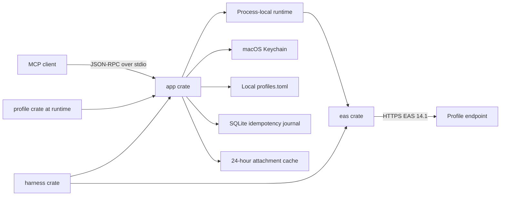

# Architecture

## Runtime shape

Each MCP client launches its own server process. There is no daemon or shared
mailbox cache. FolderSync keys, collection SyncKeys, item references, cursors,
previews, and calendar objects exist only in that process.

## Dependency direction

Runtime direction is `app -> eas`; test direction is `harness -> app + eas`.
The `profile` crate parses and validates local endpoint profiles before the app
constructs the EAS runtime. The resulting owned registry is passed through the
runtime and transport. Production crates expose no fake URL or TLS bypass.

Traits exist only for EAS transport, clock, ID generation, Keychain, operation
journal, and account backend boundaries. WBXML and domain transformations are
pure functions with concrete types.

## Runtime profiles

The public binary contains no endpoint metadata. On startup, the app reads the
user-owned `profiles.toml`, validates the whole document, and resolves each
account's `ProfileKey` against that registry. A profile fixes its DNS host,
allowed email domains, optional username realm, Device ID length, and trust
mode. It cannot configure HTTP, ports, paths, redirects, or TLS bypasses.

The bundle version and SHA-256 hash are available through `--version --verbose`
and `doctor`. Profile replacement is atomic and is rejected when it invalidates
an existing account or changes a Device ID length already in use.

## EAS state

The process runs `OPTIONS`, `Provision`, and `FolderSync`, then synchronizes mail
and calendar collections. Mail uses policy-capped `FilterType=5`; calendar uses
policy-capped `FilterType=6`. A default `mail_list` synchronizes Inbox and Sent;
explicit `folder_ids` select other mail collections, and `sync_now` still
refreshes every collection in its scope. Pages are consumed until
`MoreAvailable` disappears, including empty intermediate pages.

Each collection owns its SyncKey. An invalid key resets only that collection.
`Add`, `Change`, `Delete`, and `SoftDelete` are applied in wire order. A missing
field preserves the old value; a present empty field clears it.

List and search results become immutable RAM snapshots for 15 minutes, with at
most 32 snapshots. Search always uses EAS Search. Full bodies and attachments
use ItemOperations only on demand.

## Persistent state

- Keychain: password, Device ID, policy state, and operation HMAC key.
- Profile TOML: endpoint metadata and optional public trust certificate.
- TOML: profile key, email, username, enabled state, and write permission.
- SQLite: operation UUID, account, kind, payload HMAC, EAS ClientId, state, and
  timestamps. No mailbox content is stored.
- Cache: explicitly requested attachments, mode 0600, removed after 24 hours.

## MCP contract

All tool results use `data`, `error`, and `warnings`. One account may fail while
another returns data. Limits are 100 records, 500-character previews, 12,000
body characters by default, and 50,000 maximum. Calendar is read-only. Four mail
writes require account opt-in and durable idempotency state before the EAS
request. An explicit write-tool call validates and executes immediately; draft
or review workflows remain in the agent and must not call the mutation tool.
